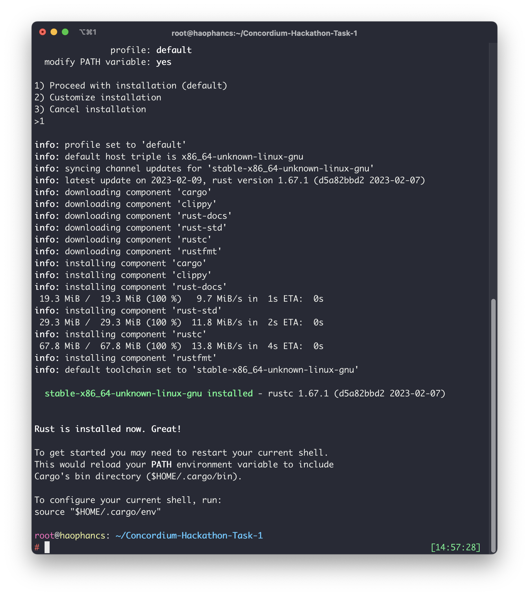
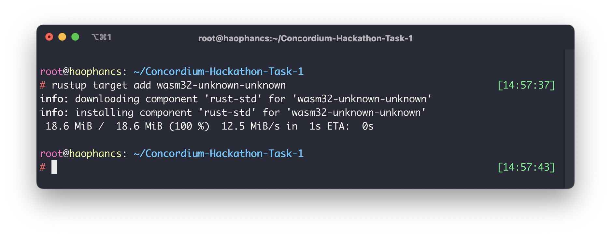
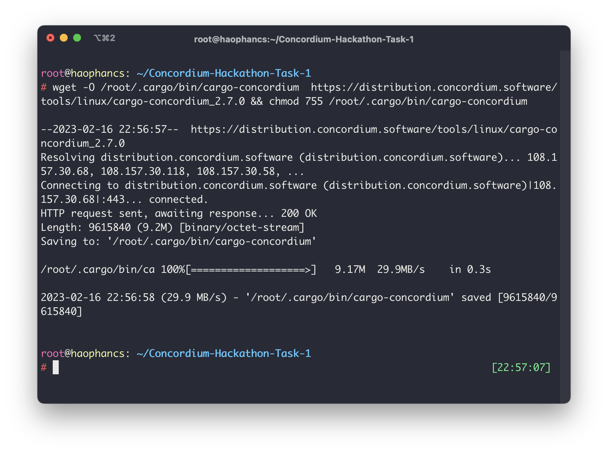
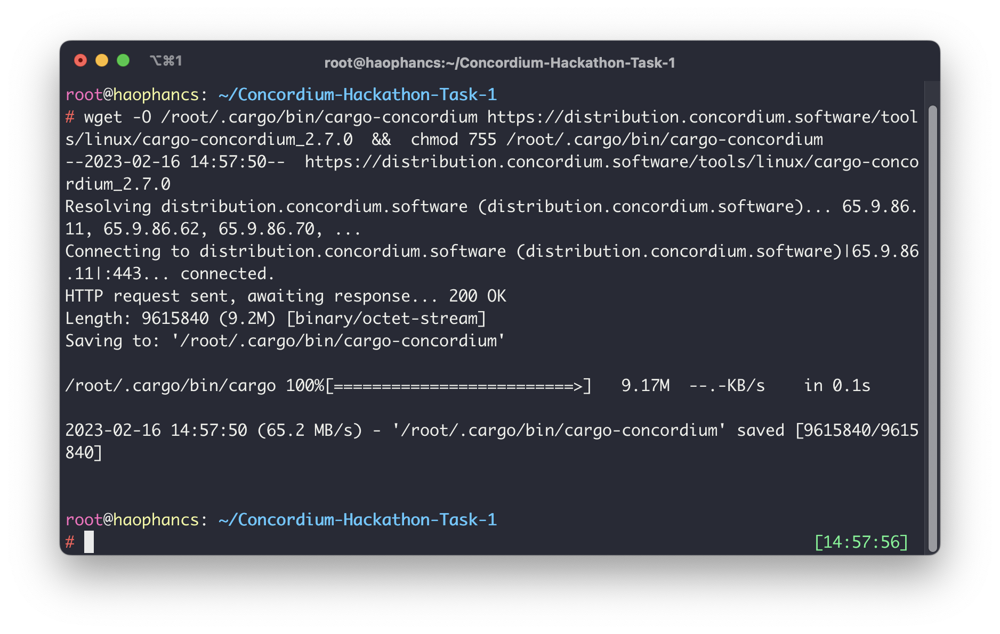
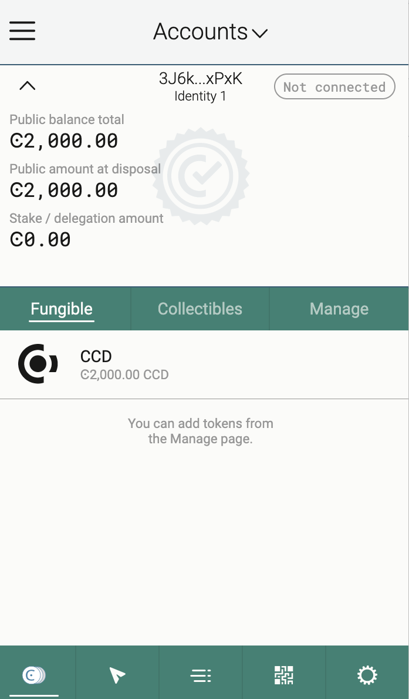
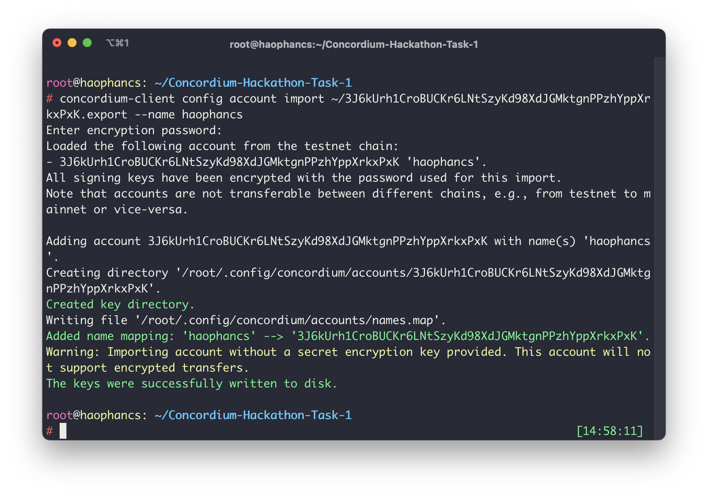

# concordium-task-1-submission
Mainnet Wallet: 3UxeSweuhQZUV35MgsmzGdY6t1BxCoibA8N49qmohevLyZHyao

## Introduction
This project is a submission for the Concordium Hackathon Task 1. The goal of this project is to help developers to setup and configure their environment to be able to work with Concordium blockchain.
## Installation
### Step 1: Install Rust
Rust is a programming language that is required to develop and deploy smart contracts on Concordium. To install Rust, please follow the instructions on this website: https://www.rust-lang.org/tools/install

### Step 2: Install cargo-concordium
cargo-concordium is a command-line tool that provides several features, including compiling smart contracts, deploying them to the Concordium network, and managing accounts. 

### Step 3: Install Concordium-client
Concordium-client is a graphical user interface that allows you to manage your accounts, transactions, and smart contracts. To install Concordium-client, please visit the following website: https://github.com/Concordium/concordium-client/releases

## Testnet Account
### Step 4: Create a Testnet account and acquiring testnet CCD via the CCD faucet
To create a Testnet account, please follow the instructions on this website: https://developer.concordium.software/docs/quick-start/testnet-accounts/

Once you have created your account, you can acquire testnet CCD by visiting the following website: https://faucet.concordium.software/

### Step 5: Export the account from web wallet and import it into Concordium client
To export your account from the web wallet, please follow the instructions on this website: https://developer.concordium.software/docs/quick-start/testnet-accounts/

To import your account into Concordium client, please follow the instructions on this website: https://developer.concordium.software/docs/concordium-client/importing-an-account/

